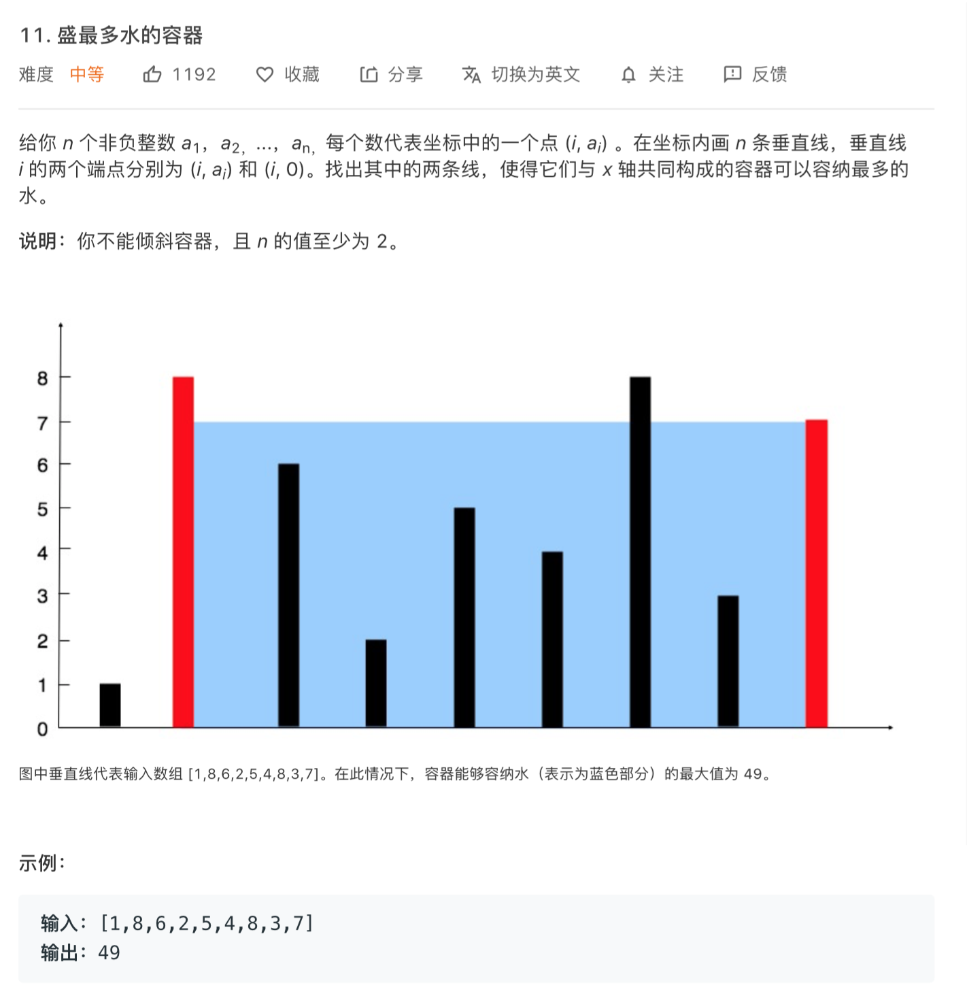

这道题要解决的问题是：找寻最大的一组(i,j)，使得Area最大


```c++
area = min(height[i],height[j])*(j-i)
```


解法1：复杂度=O(n^2)  

直接遍历两遍

```c++
#include <cmath>
class Solution {
public:
    int maxArea(vector<int>& height) {
        int vector_size = height.size();
        //int currentmax_left = 0,currentmax_right = 1;
        int currentmax_area = 0;
        int current_area=0;
        for(int i = 0;i<vector_size-1;i++){
            for(int j = i+1;j<vector_size;j++){
                current_area = min(height[i],height[j])*(j-i);
                if(current_area > currentmax_area){
                    currentmax_area = current_area;
                }
            }
        }
        return currentmax_area;
    }
};
```


解法2：复杂度=O(n)

动态规划：两边指针，每次移动小的，因为移动大的则面积肯定变小，移动大的才有可能变大

```c++
#include <cmath>
class Solution {
public:
    int maxArea(vector<int>& height) {
        int height_size = height.size();
        int current_maxarea = 0;
        int current_area = 0;
        for(int i = 0,j = height_size-1;i<j;){
            current_area = min(height[i],height[j])*(j-i);
            if(current_area > current_maxarea){
                current_maxarea = current_area;
            }
            if(height[i]<height[j])i++;
            else j--;
        }
        return current_maxarea;
    }
};
```