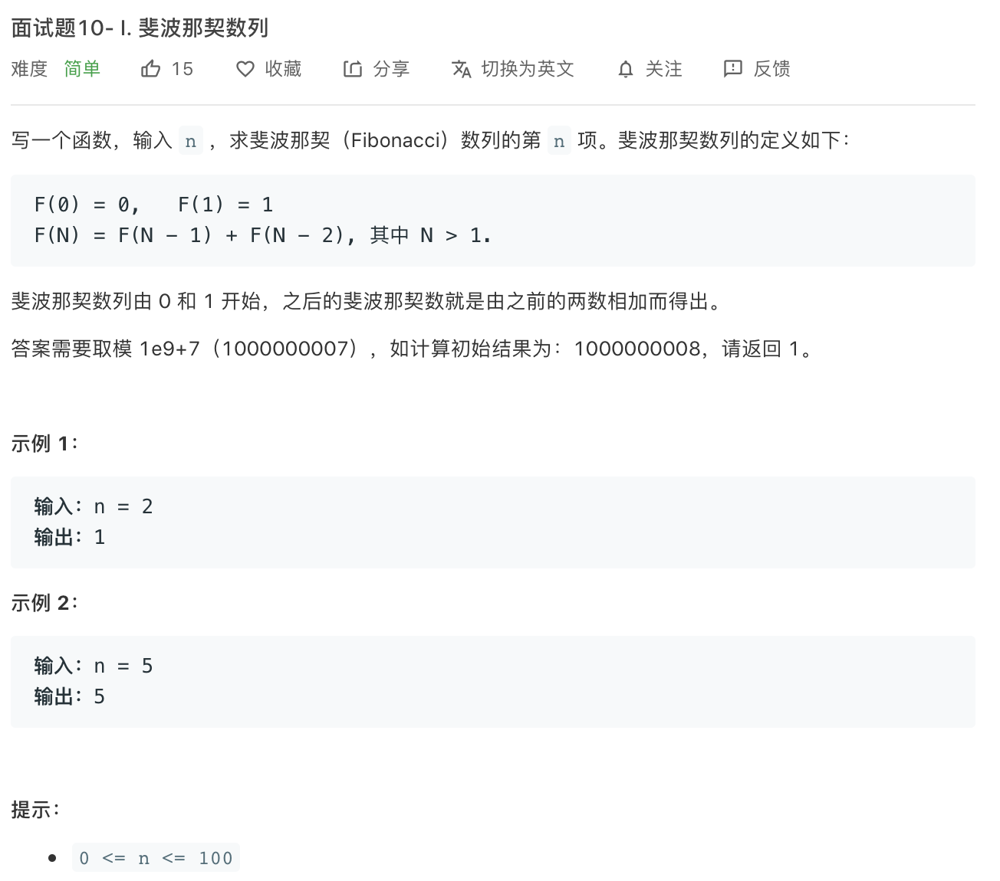

解法一：第一反应是递归（不可行）但超时了

```c++
class Solution {
public:
    int fib(int n) {
        if(n==0)return 0;
      	else if(n==1 || n==2)return 1;
      	else{
          return ((fib(n-2)%1000000007)+(fib(n-1)%1000000007))%1000000007;
        }
    }
};
```


解法二：

记忆法：用vector<int>来记忆算过的数

```c++
class Solution {
public:
    int fib(int n) {
        vector<int> vec_fib;
        vec_fib.push_back(0);
        vec_fib.push_back(1);
        vec_fib.push_back(1);
        for(int i=3;i<=n;i++){
            vec_fib.push_back(((vec_fib[i-2]%1000000007)+(vec_fib[i-1]%1000000007))%1000000007);
        }
        return vec_fib[n];
    }
};
```

