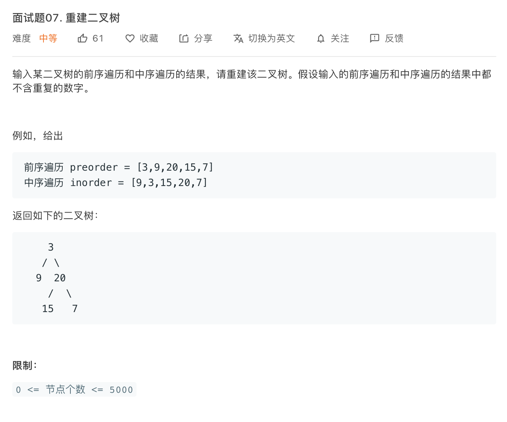
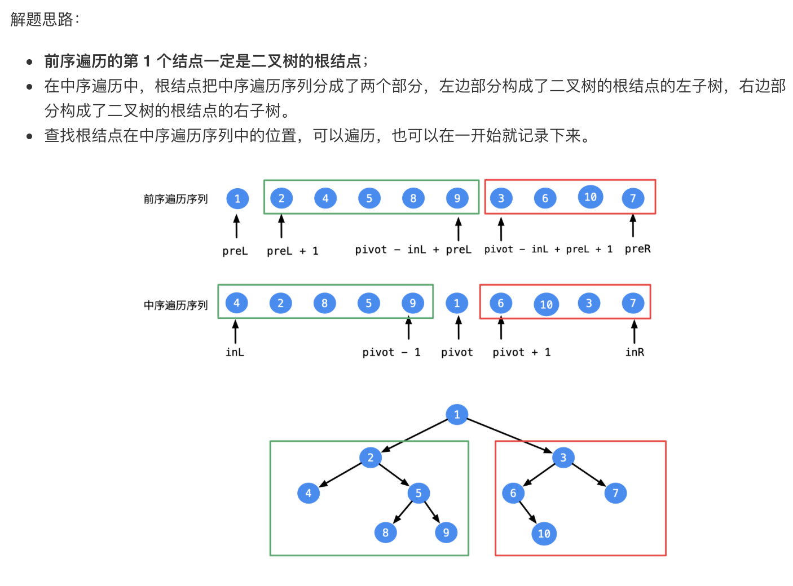

```c++
class Solution {
public:
    TreeNode* buildTree(vector<int>& preorder, vector<int>& inorder) {
      	//先去除空树
        if(preorder.size()==0||inorder.size()==0)return NULL;
	      //root node
        TreeNode* my_tree = new TreeNode(preorder[0]);
        //distance(a,b)中a,b均为元素本身而不是元素值，返回它们之间距离
        int mid = distance(begin(inorder),find(begin(inorder),end(inorder),preorder[0]));
        //这里应注意 left_pre和right_pre的元素是preorder的[1,mid]和[mid+1,最后一个元素]
      	//但是 vector<int>初始赋值的用法是前闭后开的 即[1,mid+1)和[mid+1,end)  其中end返回的不是最后一个元素的iterator 而是最后元素的下一个 如果用*(end(preorder)-1)就是最后一个元素的iterator
	      //这里赋值需要的是iterator，iterator的移动可以直接+/-
        vector<int> left_pre(begin(preorder)+1,begin(preorder)+mid+1);
        vector<int> right_pre(begin(preorder)+mid+1,end(preorder));
        vector<int> left_in(begin(inorder),begin(inorder)+mid);
        vector<int> right_in(begin(inorder)+mid+1,end(inorder));

        my_tree->left = buildTree(left_pre,left_in);
        my_tree->right = buildTree(right_pre,right_in);

        return my_tree;
    }
};
```

